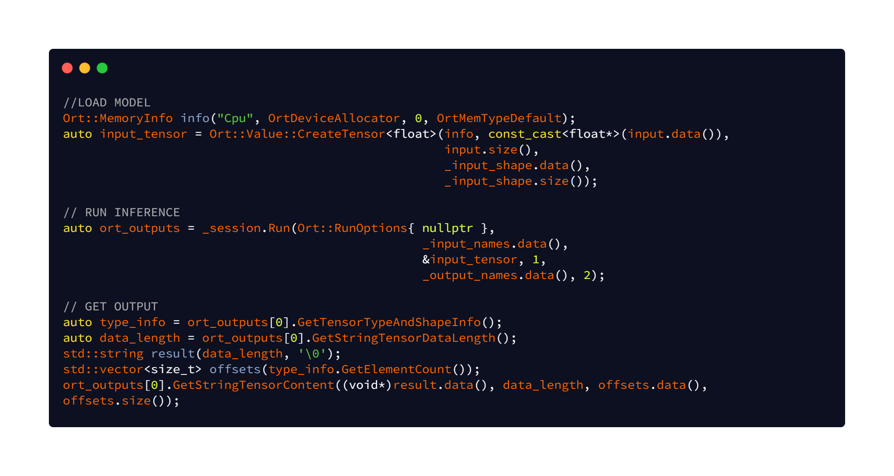
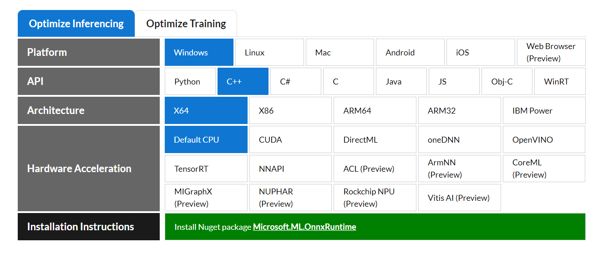
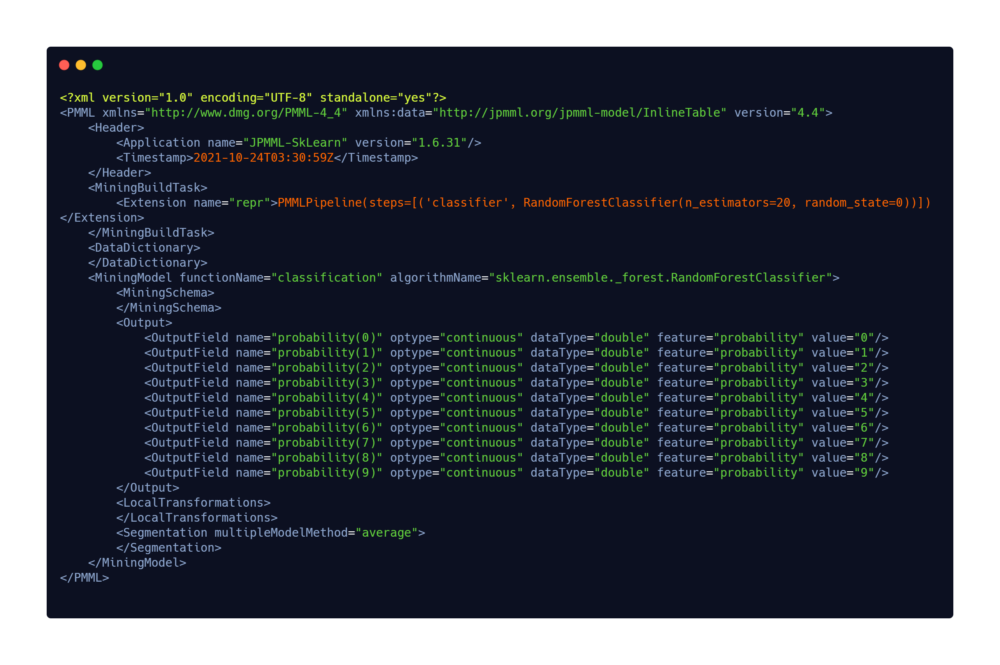
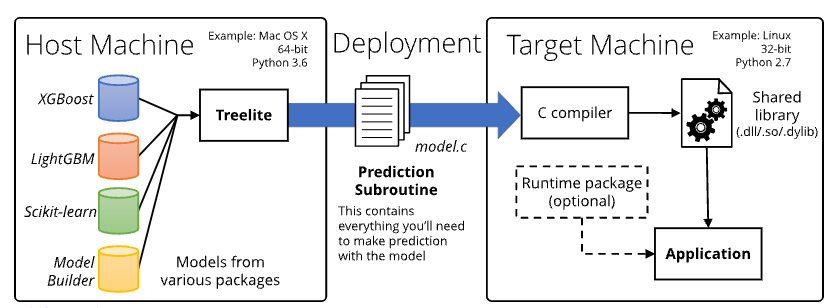
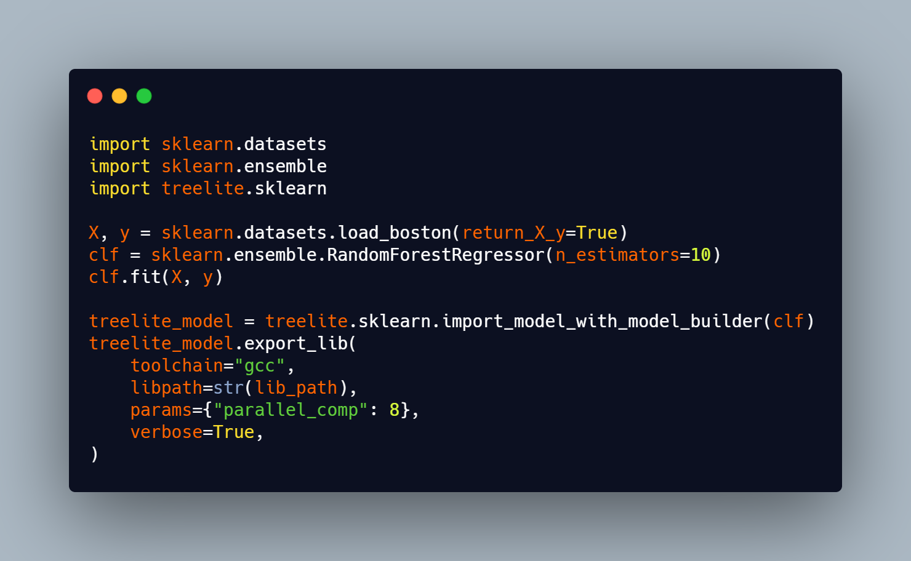
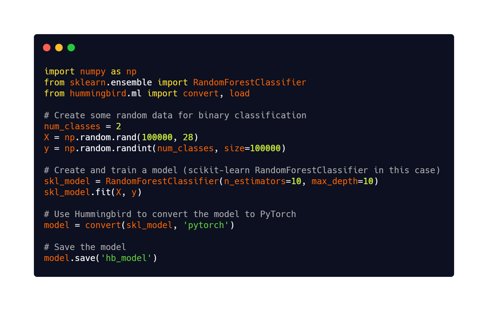

# Outline

* Using models trained using scikit-learn in a C++ Application
  * Available options
    * ONNX
    * Treelite
    * PMML 
    * ...
* Demo

---

# Available Options

* Use an intermediate format
  * Model persistence options in scikit-learn.
    * ONNX
    * PMML
  
* ONNX
  * Use ONNX Runtime for inference
  * Focus of this presentation
* PMML 
  * Use cPMML library for inference
  * Not being actively developed

---

# Other Options
* Convert the model into a library.
  * treelite
    * Converts Tree based models to shared library.
    * Works only with tree based algorithms
  * Hummingbird
    * Compiles trained traditional ML models into tensor computations.
    * Works with tree based algorithms
* Use the same underlying library that scikit learn uses
  * liblinear or libsvm
    * No direct mapping available
    * Works only with logistic regression and SVM   
* Call python interpreter from C++
  * Use libraries like pybind11, swig etc. 
    * Possible loss of performance in conversion between data types of C++ and Python
  
---

# ONNX
* Stands for **Open Neural Network Exchange**
* Definition from the official ONNX website
  * ONNX is an open format built to represent machine learning models.
  * ONNX defines a common set of operators - the building blocks of machine learning and deep learning models.
  * ONNX also defines a common file format to enable AI developers to use models with a variety of frameworks, tools, runtimes, and compilers.

---

# ONNX

---

# Why ONNX
:::::: {.columns}
::: {.column}
* Open source. 
* Community project backed by top companies

* Works with models of a wide range of frameworks.
* Works on a variety of platforms
* {height="23%"}
:::
::: {.column}
* {height="33%"}  
* {height="33%"}
:::
::::::    
    
---

# PMML
* Stands for Predictive Model Markup Language.
* XML based predictive model interchange format. 
{height="75%"}
---

# Treelite
* Definition from the website
  * Treelite is a model compiler for decision tree ensembles, aimed at efficient deployment.
  * Treelite overview
    

---

# Treelite Example

---

# Hummingbird
* Hummingbird is a library for compiling trained traditional ML models into tensor computations
* Benefits
  * Leverage optimizations implemented in neural network frameworks
  * Gives native hardware acceleration
  * Both traditional and neural network models use same framework
* Support conversion of sklearn models to Pytorch, ONNX and TVM.

---

# Hummingbird example

# Resources
* [Demo code and slides: https://github.com/abhilb/pydata_2021](https://github.com/abhilb/pydata_2021)
* [ONNX Runtime: https://onnxruntime.ai/](https://onnxruntime.ai/)
* [ONNX: https://onnx.ai/](https://onnx.ai/)
* [Treelite: https://treelite.readthedocs.io/en/latest/](https://treelite.readthedocs.io/en/latest/)
* [PMML Spec: http://dmg.org/pmml/v4-4-1/GeneralStructure.html](http://dmg.org/pmml/v4-4-1/GeneralStructure.html)
* [sklearn2pmml: https://github.com/jpmml/sklearn2pmml](https://github.com/jpmml/sklearn2pmml)
* [Hummingbird: https://github.com/microsoft/hummingbird](https://github.com/microsoft/hummingbird)