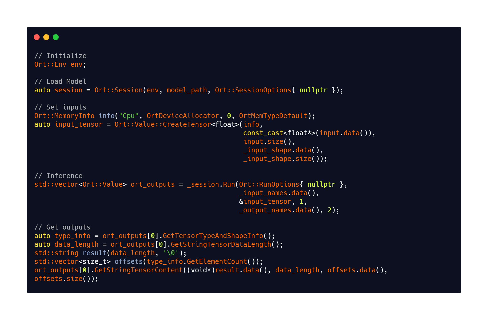
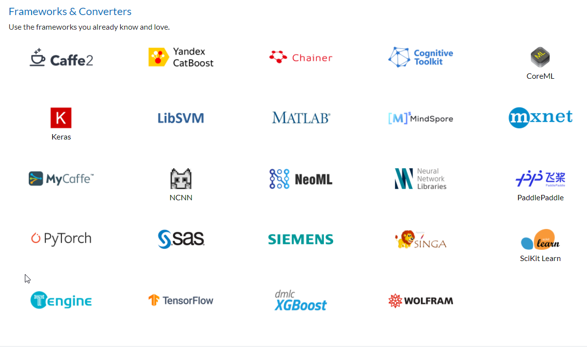
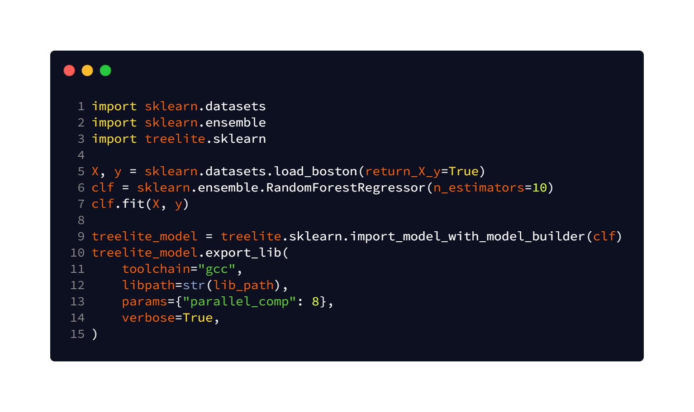

# Outline

* Using models trained using scikit-learn in a C++ Application
  * Available options
    * ONNX
    * Treelite
    * PMML 
    * ...
* Demo

---

# Available Options

* Use an intermediate format
  * From the scikit-learn documentation
    * ONNX
    * PMML

* Use the same underlying library that scikit learn uses
  * liblinear
  * libsvm

* Other options
  * treelite

---

# ONNX
* Stands for **Open Neural Network Exchange**
* Definition from the official ONNX website
  * ONNX is an open format built to represent machine learning models.
  * ONNX defines a common set of operators - the building blocks of machine learning and deep learning models.
  * ONNX also defines a common file format to enable AI developers to use models with a variety of frameworks, tools, runtimes, and compilers.

---

# ONNX
{width=75%}

---

# Why ONNX
:::::: {.columns}
::: {.column}
* Open source. 
* Community project backed by top companies

* Works with models of a wide range of frameworks.
* Works on a variety of platforms
* {height="23%"}
:::
::: {.column}
* {height="33%"}  
* {height="33%"}
:::
::::::    
    
---

# PMML
* Stands for Predictive Model Markup Language.
* XML based predictive model interchange format. 
{height="75%"}
---

# Treelite
* Definition from the website
  * **Treelite is a model compiler for decision tree ensembles, aimed at efficient deployment.**
  * Treelite overview
    

---

# Treelite Example

---

# Resources
* [https://github.com/abhilb/pydata_2021](https://github.com/abhilb/pydata_2021)
* [https://onnxruntime.ai/](https://onnxruntime.ai/)
* [https://onnx.ai/](https://onnx.ai/)
* [https://treelite.readthedocs.io/en/latest/](https://treelite.readthedocs.io/en/latest/)
* [http://dmg.org/pmml/v4-4-1/GeneralStructure.html](http://dmg.org/pmml/v4-4-1/GeneralStructure.html)